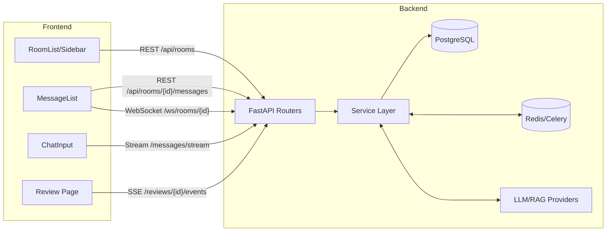
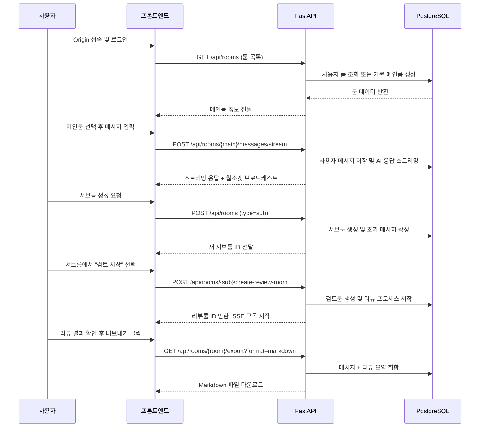

# Origin 시스템 종합 리포트

## 1. 아키텍처 개요

### 1.1 백엔드
- **FastAPI 애플리케이션**: 전역 로깅 필터, 레이트 리미터, CORS/GZip 미들웨어, Prometheus 계측, OpenTelemetry 초기화 등을 포함한 FastAPI 앱으로 구성됩니다.【F:app/main.py†L12-L195】
- **도메인 라우터 구조**: `rooms`, `messages`, `reviews`, `rag`, `conversations` 등 기능별 라우터가 독립적으로 관리되며, 서비스 레이어를 통해 데이터베이스/메모리/LLM과 상호작용합니다.【F:app/main.py†L181-L194】【F:app/api/routes/messages.py†L33-L123】
- **스토리지 서비스**: `StorageService`가 PostgreSQL에 대한 CRUD, 메시지 암호화, 리뷰 메타데이터 저장 등을 통합 관리합니다.【F:app/services/storage_service.py†L49-L200】【F:app/services/storage_service.py†L236-L265】
- **실시간 기능**: 웹소켓 매니저를 통해 룸 단위 브로드캐스트를 수행하고, 리뷰 진행 상황은 SSE로 스트리밍됩니다.【F:app/api/routes/websockets.py†L1-L61】【F:app/api/routes/messages.py†L361-L418】
- **배경 작업/캐시**: Redis 기반 캐시와 백그라운드 작업 서비스를 활용하여 토큰 사용량 제한, 임베딩 생성, 사실 추출 등을 비동기 처리합니다.【F:app/api/dependencies.py†L63-L140】【F:app/services/conversation_service.py†L23-L86】

### 1.2 프론트엔드
- **React + React Query**: `App.jsx`에서 라우팅과 전역 컨텍스트를 구성하고, React Query로 룸/스레드 데이터를 캐시합니다.【F:app/frontend/src/App.jsx†L1-L118】
- **룸 계층 뷰**: 메인 페이지는 사이드바-스레드-채팅 뷰로 나뉘며, 룸 타입에 따라 메시지 리스트/스레드 전환을 수행합니다.【F:app/frontend/src/pages/Main.jsx†L11-L57】
- **채팅 인터랙션**: `MessageList`는 REST와 웹소켓을 조합하여 메시지를 동기화하고, `ChatInput`은 스트리밍 엔드포인트를 통해 AI 응답을 실시간 갱신합니다.【F:app/frontend/src/components/MessageList.jsx†L26-L133】【F:app/frontend/src/components/ChatInput.jsx†L8-L154】
- **검토(Room Review) 화면**: 리뷰 SSE 이벤트를 구독하면서 최종 보고서와 라이브 메시지를 동시에 표현합니다.【F:app/frontend/src/pages/Review.jsx†L13-L176】

### 1.3 지원 인프라
- **데이터베이스**: 환경 변수 기반 Postgres 설정과 필수 `DB_ENCRYPTION_KEY`로 구성됩니다.【F:app/config/settings.py†L12-L88】
- **메시징/작업 큐**: Redis URL 설정 시 캐시 및 토큰 사용량 추적, 백그라운드 태스크 스케줄링을 수행합니다.【F:app/services/conversation_service.py†L18-L63】
- **관측성**: Prometheus 지표, OpenTelemetry 추적, 경고 설정이 포함되어 운영 가시성을 확보합니다.【F:app/main.py†L82-L148】【F:app/config/settings.py†L96-L148】

## 2. 데이터 흐름 요약

### 주요 시나리오 별 흐름
1. **채팅 송수신**: 사용자가 `ChatInput`에서 메시지를 전송하면 스트리밍 엔드포인트가 메시지를 저장하고 AI 응답을 청크 단위로 반환하며, 완료 후 웹소켓 브로드캐스트로 타 클라이언트가 갱신됩니다.【F:app/frontend/src/components/ChatInput.jsx†L8-L154】【F:app/api/routes/messages.py†L361-L418】【F:app/api/routes/websockets.py†L24-L41】
2. **서브룸 컨텍스트 상속**: 새로운 세부 룸 생성 시 부모 룸 메시지/메모리를 기반으로 환영 메시지를 작성하고 초기 시스템 메시지를 저장합니다.【F:app/api/routes/rooms.py†L25-L118】
3. **리뷰 진행**: SSE로 리뷰 상태 변화를 실시간 전송하고, 최종 보고서를 저장 후 MessageList에 기록합니다.【F:app/frontend/src/pages/Review.jsx†L40-L165】【F:app/services/storage_service.py†L266-L283】
4. **내보내기**: 룸 히스토리와 리뷰 요약을 취합하여 JSON/Markdown으로 내려받습니다.【F:app/api/routes/rooms.py†L383-L431】【F:app/models/schemas.py†L74-L170】

## 3. 보안/성능/테스트 커버리지 진단

### 3.1 보안 이슈
- **웹소켓 인증 우회 가능성**: 프론트엔드가 토큰 없이 웹소켓에 연결하도록 구현되어 있어, `AUTH_OPTIONAL=False` 환경에서 연결이 거부되거나 우회 구성이 필요합니다. Subprotocol에 Firebase 토큰을 포함하도록 수정해야 합니다.【F:app/frontend/src/components/MessageList.jsx†L55-L59】【F:app/api/routes/websockets.py†L31-L53】
- **디버그 엔드포인트 노출 위험**: `/api/debug/env`는 관리자 역할 검증을 하지만 민감 정보 길이를 제공하므로 운영 배포 시 비활성화하거나 감사 로깅을 강화할 필요가 있습니다.【F:app/main.py†L201-L233】

### 3.2 성능 이슈
- **메시지 전체 로딩**: `get_messages`가 룸 전체 메시지를 모두 조회하기 때문에 대용량 대화에서 응답 지연과 메모리 사용이 급증할 수 있습니다. 페이지네이션과 증분 로딩을 도입해야 합니다.【F:app/services/storage_service.py†L236-L264】
- **프론트엔드 재렌더 비용**: `MessageList`는 웹소켓 이벤트마다 전체 메시지 리스트를 재구성하므로, 가상화나 배치 업데이트로 최적화할 여지가 있습니다.【F:app/frontend/src/components/MessageList.jsx†L26-L132】

### 3.3 테스트 커버리지 이슈
- **리뷰 실시간 경로 미검증**: 통합 테스트는 REST 기반 사용자 여정만 검증하며 SSE/스트리밍/웹소켓 경로는 커버하지 못합니다. 실시간 통신 회귀 테스트가 필요합니다.【F:tests/test_user_flow.py†L7-L76】
- **프론트엔드 단위 테스트 부재**: React 컴포넌트에 대한 테스트 파일이 없어 주요 상호작용(웹소켓 재연결, 스트리밍 처리 등)이 자동화되지 않습니다. Jest/React Testing Library로 핵심 컴포넌트를 검증해야 합니다.【F:app/frontend/src/components/MessageList.jsx†L26-L142】【F:app/frontend/src/components/ChatInput.jsx†L8-L200】

## 4. 사용자 관점 흐름 시뮬레이션

## 5. "GPT스러운 경험"을 위한 개선 포인트
1. **맥락 추적 강화**: 서브룸 생성 시 생성된 시스템 요약을 UI에서 명시적으로 노출하여 사용자가 AI의 컨텍스트 이해도를 확인할 수 있게 합니다.【F:app/api/routes/rooms.py†L25-L118】
2. **실시간 피드백 시각화**: 스트리밍 중 진행률/생성 모델 정보를 ChatInput 주변에 표시하여 AI 사고 과정을 보여줍니다.【F:app/frontend/src/components/ChatInput.jsx†L142-L153】
3. **리뷰 협업 기능**: 리뷰 SSE 이벤트를 기반으로 패널별 타임라인을 시각화하면 AI 패널 토론감을 높일 수 있습니다.【F:app/frontend/src/pages/Review.jsx†L40-L165】
4. **추천 액션 자동화**: 내보내기 시 추출된 추천 항목을 바로 작업 항목으로 전환할 수 있는 CTA(예: Jira 티켓 생성)를 제공하면 AI 어시스턴트 경험이 강화됩니다.【F:app/api/routes/rooms.py†L383-L431】

## 6. 즉시 적용한 개선 사항
- **룸 타입 기반 액션 표시 복구**: `MessageList`와 `Sub` 페이지에서 `ChatInput`으로 룸 메타데이터를 전달하여 메인/서브룸에 맞는 서브룸 생성·검토 시작 버튼이 다시 노출되도록 수정했습니다.【F:app/frontend/src/components/MessageList.jsx†L93-L140】【F:app/frontend/src/pages/Sub.jsx†L33-L63】
- **검증 시도**: 프론트엔드 의존성 설치를 시도했으나 `react-diff-viewer`의 peer dependency 충돌로 실패했습니다. CI 환경에서는 `npm install --legacy-peer-deps` 또는 패키지 업그레이드를 검토해야 합니다.【7f5319†L1-L32】

